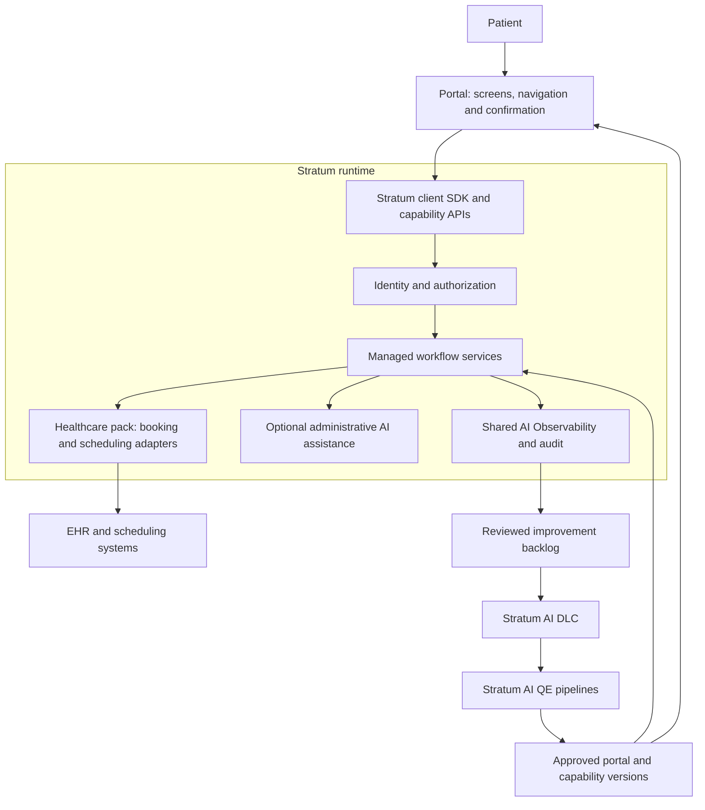

# Patient Portal — A Thin Application on Stratum

**Architecture and executive progress brief | 1 October 2026 | Proposed design**

## Purpose and strategic importance

Create a patient-facing application that makes administrative access to care easier while giving service owners evidence to improve access, staff workload, and operational performance.

The portal is the first thin reference application on **Stratum**, the reusable AI Factory. It owns the patient experience and consumes platform capabilities through versioned APIs and a shared client library. It will demonstrate how a business objective becomes an approved requirement, a verified software release, and a measurable patient journey.

The proposed value combines patient self-service with operational learning: patients complete a defined task, service teams see where completion fails, and approved improvements move through a consistent delivery process.

**Current position:** architecture, booking scope, example configuration, and ten acceptance scenarios are drafted. Application code, executed tests, live integrations, and realized benefits remain to be demonstrated.

## Place in the Cloud–Core–Edge architecture

The portal sits at the application edge and consumes Stratum's core capability APIs. Optional cloud services are selected and operated by Stratum. The portal has no model credentials, agent runtime, retrieval index, tool broker, or quality pipeline of its own.

The core hosts the healthcare domain pack, scheduling adapter, workflow state, authorization, AI assistance, and shared telemetry. The portal renders available slots, requests confirmation, and displays the authoritative result. Enterprise scheduling remains the source of truth. An unavailable optional AI service must not prevent deterministic booking when scheduling and identity services are healthy.

The deployment sequence is **Deploy** a synthetic booking journey, **Interconnect** approved identity and scheduling services, then **Extend** to further applications or sites after evidence supports expansion. The portal stays equally thin at each stage.

## Goals

| Goal | Intended outcome | Evidence of success |
|---|---|---|
| Improve access | Help patients complete eligible bookings | Booking completion and time to book |
| Reduce administrative burden | Reduce repeated contacts and manual correction | Staff handling time and contacts per booking |
| Support reliable operations | Prevent duplicate actions and inaccurate status | Duplicate bookings, unresolved requests, and recovery time |
| Identify access friction | Locate abandonment and assistance needs | Completion and escalation by journey step |
| Support equitable usability | Make core tasks accessible and retain assisted alternatives | Accessibility review and completion differences across supported channels |
| Validate platform reuse | Deliver the application through common factory controls | Requirement-to-release evidence and shared-capability reuse |

Benefits are hypotheses to test. The booking demonstration will not establish clinical outcomes, reduced no-shows, or financial return.

## Problems the application will address

**Fragmented administrative journeys:** patients may need several interactions to find an option, confirm it, and understand its status. A coherent workflow makes the next action and current outcome explicit.

**Work shifted to staff when self-service fails:** unclear errors, duplicate requests, and uncertain status create follow-up work. Confirmation and recovery are designed into the workflow.

**Limited visibility into access barriers:** activity totals do not explain which step fails. Defined journey events help service owners investigate friction and prioritize improvement.

**Variation across care settings:** locations and service lines may have different scheduling rules. Versioned configuration supports approved local variation without duplicating the application.

Discovery will validate these hypotheses against the selected setting and existing digital experience. The pilot should address an identified gap rather than create a redundant patient channel.

## What differentiates this design

| Design choice | Strategic relevance |
|---|---|
| Patient journey connected to operational measures | Links experience changes to access and workforce performance |
| Built through the reusable factory | Demonstrates repeatable quality and traceability across products |
| Explicit healthcare configuration | Supports consistent practices and approved local variation |
| Integration boundary around existing systems | Preserves authoritative records and supports vendor-specific connections |
| Optional, constrained AI assistance | Adds navigation support while retaining the standard workflow |
| Improvement feedback linked to release evidence | Shows what changed and what happened afterward |

These are intended differentiators of the combined architecture. Their value will be tested through user research, integration discovery, and pilot results.

## Architecture and platform relationship

The portal is deliberately thin: a user interface plus approved experience configuration. The generic platform hosts separately versioned domain packs; the healthcare pack contains patient-specific rules, booking logic, and vendor adapters. Healthcare behavior stays outside the generic core and outside the portal UI.

| Concern | Portal owns | Stratum supplies and operates |
|---|---|---|
| Experience | Screens, navigation, branding, accessibility, and clear status | Shared components and client SDK |
| Business behavior | Product requirements and approved local configuration | Healthcare capability services, validations, and workflow state |
| Security | Session interaction and confirmation presentation | Identity validation, patient-context resolution, authorization, and policy enforcement |
| AI | Entry points and presentation of responses | Model access, prompts, retrieval, tools, guardrails, and orchestration |
| Integrations | Selection of approved capabilities | EHR/scheduler adapters, credentials, retries, and reconciliation |
| Quality | Acceptance scenarios and expected user experience | AI QE infrastructure, evaluation suites, gates, and evidence |
| Operations | Journey definitions and business-owner interpretation | Traces, dashboards, audit, alerts, budgets, and runbooks |

Domain experts approve healthcare rules; platform teams operate the reusable capability implementations. Simplicity in the portal does not remove accountability for clinical policy or user experience.

The delivery control plane is outside live patient requests. The runtime plane is a live dependency: if booking APIs are unavailable, the portal displays an unavailable or pending state and an approved assisted-service route. If only optional AI fails, the standard booking interface continues through deterministic capability APIs.

## Consuming AI DLC, AI QE, and AI Observability

**AI DLC:** the portal registers its manifest, requested capabilities, approved requirements, and acceptance scenarios. Stratum handles planning, implementation execution, verification routing, versioned release, and improvement tracking. The portal has no separate lifecycle engine.

**AI QE pipelines:** Stratum runs UI, accessibility, API contract, authorization, transaction, resilience, and AI-behavior evaluations. Portal owners define expected journeys and review results. Changes to the healthcare pack, model, prompt, tool schema, or retrieval content trigger affected consumer checks. The portal has no separate evaluation infrastructure.

**AI Observability:** the shared SDK and platform services correlate patient-journey events with workflow, model, tool, and scheduler traces. Standard dashboards expose completion, errors, pending requests, AI quality signals, latency, and cost. Sensitive data is minimized; identity and clinical content are not copied into general telemetry. The portal has no separate telemetry backend.

### Example capability contract

The following are proposed API responsibilities, not implemented endpoints:

| Patient action | Platform capability | Portal behavior |
|---|---|---|
| Sign in | Resolve authenticated subject and permitted capabilities | Show the allowed experience |
| Find an appointment | Search eligible slots within authorized context | Render options |
| Select an option | Create an expiring booking proposal bound to exact details | Present provider, location, type, and time |
| Confirm | Validate patient confirmation and execute booking with duplicate protection | Submit the explicit patient action |
| Check status | Return authoritative confirmed, pending, conflict, or failed status | Render the outcome and next action |

Patient identity is resolved by the service, not trusted from browser parameters. Confirmation is tied to the server-created proposal and authenticated context; a model-generated flag cannot authorize a booking. The client never receives EHR credentials. API and pack versions are pinned and compatibility-tested before upgrade.

## First demonstration: appointment booking

The demonstration supports an adult patient acting for themselves in one organization, using synthetic records and a simulated scheduler.

1. The patient signs in; the server establishes authorized patient context.
2. The portal displays eligible options with provider, location, time, and type.
3. The patient confirms a specific selection.
4. The service validates identity, confirmation, and current availability.
5. The scheduler returns a confirmed, pending, or unsuccessful result.
6. The portal displays that result and records an operational event.

AI may help express preferences or find administrative guidance. Stratum healthcare services own authorization and execution. Conversation text cannot grant access or substitute for confirmation.

Changed availability requires a new selection. Uncertain external responses remain pending until reconciled. Retries must not create duplicate bookings. The authoritative scheduler must protect against competing bookings from all channels.

## Data, integration, and operating boundaries

The electronic health record (EHR) and scheduling systems remain authoritative for patient records and bookings. Stratum services retain necessary workflow state, preferences, and integration references; the portal keeps only transient presentation state. Identity comes from an approved service; patient matching is not inferred from names or model output.

Adapters use vendor-supported interfaces and agreed data contracts. Some integrations may support appointment requests without immediate confirmation; the interface must reflect the actual outcome. These capabilities must be validated before pilot commitments.

Patient records, audit events, and analytical measures have separate access and retention rules. Development uses synthetic data. Reporting uses minimized data and authorized aggregation. Cross-site comparisons require consistent definitions and suitable cohorts; patient-level data is not shared merely to enable benchmarking.

Authorization applies to every operation. AI tools are restricted. Audit records document access and consequential actions without copying clinical content into general telemetry. Production use requires agreed data policies, security review, operational ownership, and tested recovery.

## Scope

The initial scope covers sign-in, appointment search, confirmation, status, failure recovery, and journey events. Subsequent evaluation may add administrative guidance, cancellation, secure messaging, and assisted-service handoff. Released results, renewal requests, delegated access, and additional care settings require separate decisions.

Diagnosis, prescribing, treatment recommendations, and emergency triage are outside the initial scope. Clinical interpretation and care decisions are not delegated to the assistant.

## Measurement and improvement

The proposed loop is **observe performance → investigate causes → approve a change → deliver through the factory → compare results**. Service owners interpret findings and approve priorities; analytics does not authorize workflow changes automatically.

| Measure | Proposed definition | Interpretation |
|---|---|---|
| Booking completion | Confirmed bookings divided by eligible journeys started | Report pending cases and failed steps separately |
| Time to book | Median time from journey start to confirmation | Separate interaction time from scheduling delay |
| Administrative effort | Staff minutes per completed booking across measured channels | Include escalation and correction work |
| Reliability | Duplicate bookings and unresolved operations per attempt | Distinguish portal and source-system failures |
| Access friction | Abandonment and assistance requests by step | Review by location, service line, and supported channel where appropriate |

Agree on baselines, populations, and observation windows before comparison. Capacity, appointment mix, and seasonal demand affect results. Financial estimates must include integration, support, AI, and staff costs. Clinical benefit requires separate evidence.

## Progress and milestones

| Workstream | Status | Next evidence |
|---|---|---|
| Architecture and boundaries | Drafted | Product and technical review |
| Booking specification | Drafted | Approved behavior and implementation plan |
| Acceptance scenarios | Ten defined; not executed | Recorded results against a working implementation |
| Synthetic demonstration | Planned | Complete journey delivered through the factory |
| AI DLC consumption | Specified; not implemented | Portal manifest drives a complete platform delivery run |
| AI QE consumption | Specified; not implemented | Platform pipeline executes portal acceptance and AI evaluation suites |
| AI Observability consumption | Specified; not implemented | Shared trace, dashboard, alert, and budget visibility |
| Thin application boundary | Specified; not implemented | Portal renders outcomes; platform services execute rules and integrations |
| Integration pilot | Pending | Vendor tests, privacy/security acceptance, support model, and baseline results |

The ten scenarios cover successful booking, patient isolation, retries, competing bookings, changed availability, uncertain outcomes, assistant outage, malicious instructions, invalid confirmation, and time zones.

The next step is a bounded synthetic demonstration. Leadership alignment is needed on the target care setting, accountable product and operations owners, implementation capacity, and approved environment. Pilot investment should depend on demonstrated reliability, feasible integrations, and a measurable operational opportunity.

**Companion:** [Stratum platform architecture](../../stratum/Architecture.md).
