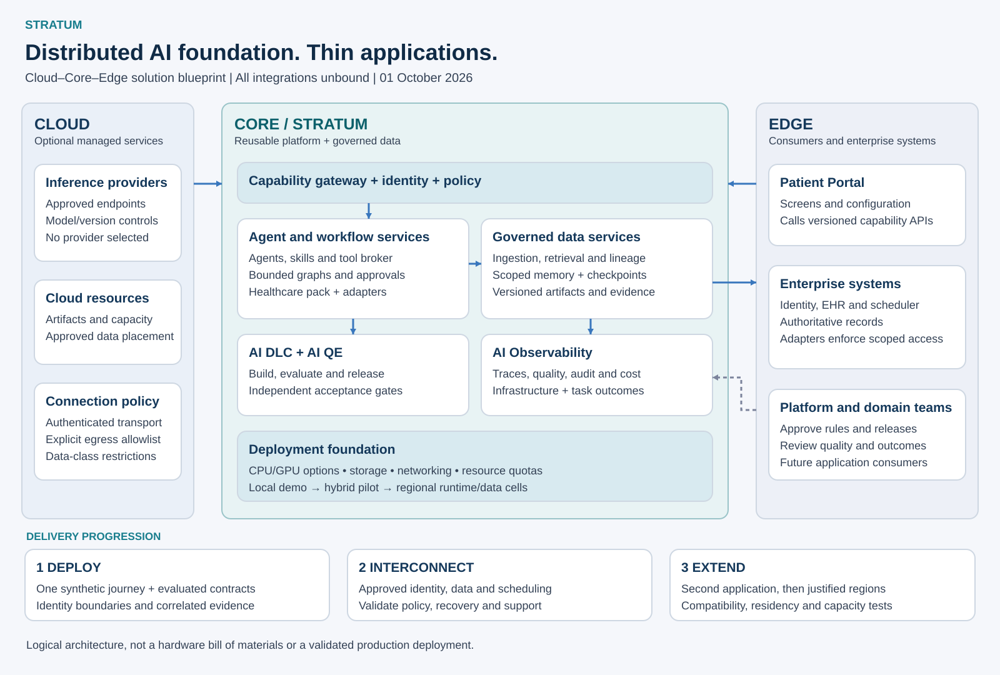

# Stratum — Reusable AI Factory

**Architecture and executive progress brief | 1 October 2026 | Proposed design**

## Purpose and strategic importance

Create a reusable foundation that builds, verifies, runs, and observes AI-enabled applications, with accountability for quality, cost, and operational impact.

**Working name: Stratum.** A foundational layer on which applications are built. The name is a proposal; brand and trademark availability have not been assessed.

The opportunity is to make software delivery a repeatable capability across a portfolio of performance-improvement applications. Expert knowledge, business rules, and successful delivery patterns become reusable assets. Leadership gains visibility into what was delivered, why it was prioritized, how it was verified, and whether it produced the intended result.

The Patient Portal is the first proposed application. Its appointment-booking journey will demonstrate the platform before expansion to other domains.

**Current position:** architecture, delivery boundaries, example specifications, and initial acceptance scenarios are drafted. A working factory, validated integrations, and measured benefits remain to be demonstrated.

## Goals

| Goal | Intended outcome | Evidence of success |
|---|---|---|
| Shorten delivery time | Move approved improvement priorities into usable software sooner | Time from approved requirement to accepted release |
| Increase team capacity | Reduce repeated setup and implementation work | Engineering effort and total cost per accepted change |
| Standardize quality | Apply consistent verification and release controls | First-pass acceptance, escaped defects, and release evidence completeness |
| Preserve domain expertise | Represent approved practices as versioned rules and tests | Reuse of validated components and configurations |
| Connect investment to value | Link each change to an operational objective | Business-owner review of post-release results |
| Scale across applications | Add domains without rewriting the factory | A second application using the same core lifecycle |

Targets will follow baseline measurement. Faster code generation alone will not count as success.

## Problems the platform will address

**Repeated work across teams:** similar setup, integration, testing, and release needs consume capacity. Shared templates and adapters make those investments reusable.

**A gap between insight and execution:** identifying an opportunity does not implement an improvement. The factory attaches an owner, acceptance criteria, a delivery workflow, and an outcome measure to approved work.

**Inconsistent AI-assisted delivery:** informal prompting and review can produce variable results. Versioned specifications, limited permissions, and independent checks establish a consistent operating model.

**Limited visibility into realized value:** completing a feature does not establish an operational benefit. Delivery evidence and post-release measures allow leaders to assess adoption, impact, and further investment.

These are design hypotheses; discovery will establish their magnitude in the participating environment.

## What differentiates this design

| Design choice | Why it matters |
|---|---|
| Business objective attached to each request | Connects prioritization to access, quality, efficiency, cost, or growth |
| Generic core with domain-specific configuration | Supports reuse with controlled local variation |
| Independent verification and release evidence | Makes acceptance reviewable beyond an agent's self-assessment |
| Expert practices represented as reusable assets | Makes knowledge repeatable and changes accountable |
| Shared outcome definitions | Supports meaningful comparison across applications and sites |
| Replaceable technology interfaces | Allows approved models, tools, and hosting to evolve |

The intended differentiator is the combination of governed delivery, reusable expertise, and outcome measurement. This is a proposed design advantage, not a claim of market exclusivity.

## Solution model: Cloud–Core–Edge

Stratum is a reusable core serving thin applications at organizational edges. Optional cloud services connect through governed ingress and egress. The core contains the agent platform and governed data services, with identity, policy, quality, and observability spanning both.

The diagram is an original logical design. Its structure is informed by the distributed architecture guide; it is not a vendor-certified deployment or a physical colocation design. See the [source-to-design mapping](../docs/research/architecture-reference-mapping.md).

| Zone | Responsibility | Boundary |
|---|---|---|
| Cloud | Optional hosted inference, artifact storage, and managed infrastructure | Approved endpoints, permitted data classes, authenticated transport, and explicit budgets |
| Core: Stratum platform | Agent execution, deterministic workflows, model gateway, tools, AI DLC and AI QE | Separate delivery, verification, runtime, and operator identities |
| Core: governed data services | Ingestion, catalog, lineage, retrieval indexes, workflow checkpoints, and artifacts | Identity-aware access; separate knowledge, state, evidence, and telemetry stores |
| Core: shared controls | Policy, human approval, audit, observability, capacity and cost management | Controls enforced by services outside model prompts |
| Edge | Thin patient portal, enterprise systems, platform operators, and future applications | Portal consumes APIs; enterprise adapters reauthorize every call |

Core means a reusable service boundary, not one mandatory building or a single database. A deployment can place runtime and data services near approved data sources. The organizational edge in this diagram does not imply hospital edge hardware is installed.

## Solution architecture and request flow

1. An authenticated application calls the capability gateway; identity is resolved server-side.
2. A policy decision selects an approved deterministic workflow or optional agent workflow.
3. An agent may retrieve permitted context and propose tool calls through the tool broker; it cannot directly access credentials or enterprise networks.
4. Healthcare services validate patient context and confirmation before an authoritative scheduling operation.
5. Correlated events record status, versions, timing and policy outcomes with minimized content.
6. The application renders the authoritative result. Reviewed operational findings return to AI QE and AI DLC.

Delivery control-plane outages do not stop deployed workflows. Runtime outages can interrupt business operations; return pending/unavailable state and reconcile uncertain writes. Optional model failure must preserve deterministic booking where its dependencies remain healthy.

## Agentic service blueprint

| Module under stratum/ | Responsibility |
|---|---|
| agents/ and prompts/ | Versioned roles, allowed tools, model routes, and task instructions |
| orchestration/ | Bounded workflow graphs, checkpoints, cancellation, timeout and failure routes |
| tools/ and skills/ | Typed operations and reusable behaviors, authorized through a broker |
| models/ | Provider-neutral routing, approved model versions, health and cost limits |
| data/ | Source approval, ingestion, provenance, retrieval and freshness |
| memory/ | Scoped session state and durable checkpoints with expiry and deletion |
| policies/ | Authentication, authorization, approval binding, sandbox and data constraints |
| registry/ | Dependency versions and release evidence references |
| lifecycle/ | AI DLC and AI QE services for code, data, prompts, models and agents |
| observability/ | Request, inference, infrastructure, cost, quality and business signals |
| infrastructure/ | Local, hybrid and private deployment profiles with capacity and network contracts |
| domain-packs/ | Healthcare and future domain behavior, separate from the generic core |
| sdk/ | Client and UI consumption boundaries |

The linked JSON catalog is a design format, not a vendor framework configuration. Its validator checks references, bounded graphs, permissions and unbound deployment state. It does not implement a gateway, policy engine, orchestrator, sandbox or model provider.

## Data and model lifecycle

Keep two paths separate. Knowledge ingestion validates source authorization, classifies content, extracts and indexes it, and records source revision, access rules, freshness and deletion lineage. Runtime retrieval filters authorization before ranking and returns source references. Operational transactions call authoritative systems; appointment records are not copied into a general-purpose retrieval index.

The demo begins with synthetic administrative content and unbound model routes. Training and fine-tuning are optional future workloads requiring a dataset, quality objective, evaluation baseline, resource estimate, and approval. Feedback is reviewed before it changes datasets or model behavior. Session history is not authorization or consent.

## Solution configuration

| Profile | Intended shape | Entry condition |
|---|---|---|
| Blueprint now | Local contracts, fixtures and validators; no running AI services | No credentials, cloud spend or GPU requirement |
| Single-site demonstration | One runtime, synthetic domain adapter, checkpoint store and telemetry sink | Implemented controls and acceptance checks |
| Hybrid pilot | Approved identity and enterprise connectors; selected managed or private inference | Data placement, connectivity, availability and recovery approved |
| Distributed expansion | Repeated runtime/data cells with shared release governance | Capacity tests, regional ownership, residency and failover validation |

Capacity is sized from workload evidence: concurrent requests, input/output tokens, model memory, retrieval volume, tool latency, acceptable queue time and availability. Measure throughput together with p95 latency and cost per completed task. GPU utilization, memory, power and network/storage metrics apply only where infrastructure is actually operated. Hardware type, rack count, power and cooling are deployment decisions, not inherited demo requirements.

## Deployment blueprint: Deploy → Interconnect → Extend

**Deploy:** establish one bounded synthetic workflow, approval and policy boundaries, evaluation evidence and trace correlation. Exit with reproducible acceptance results.

**Interconnect:** add selected identity, approved data and scheduling integrations through adapters. Validate allowed traffic, data classes, external-write reconciliation and support ownership. Private networking does not replace authorization.

**Extend:** onboard a second application, then additional runtime/data locations only when justified. Pin compatible versions, isolate tenant/session state, exercise region failure and deletion propagation, and prove capacity before expansion.

## AI DLC — AI Development Lifecycle

AI DLC covers both **software produced with AI** and **AI behavior deployed in an application**. Changes to code, prompts, models, retrieval content, tools, policies, and domain packs follow the same governed lifecycle.

| Stage | Shared platform service | Required output |
|---|---|---|
| Define | Intake, value assessment, risk classification, and scope review | Approved intent, owner, baseline, and acceptance criteria |
| Specify | Requirements, architecture, data contracts, and evaluation design | Versioned implementation and evaluation specification |
| Build | Isolated workers, approved templates, context assembly, and bounded repair | Candidate code and AI configuration |
| Verify | Independent AI QE pipeline | Results bound to candidate versions |
| Release | Approval, compatibility checks, staged rollout, and rollback controls | Approved release manifest and deployment record |
| Operate and improve | Observability, incident review, regression creation, and retirement | Reviewed improvement backlog and outcome assessment |

The release manifest binds application code, domain-pack version, model deployment, prompt version, tool schemas, retrieval snapshot or index version, policy version, and evaluation suite. Changing a material dependency triggers the applicable checks before promotion. Production observations cannot silently rewrite prompts or policies.

## AI QE — shared Quality Engineering pipelines

Quality Engineering is a platform service consumed by every application. The application supplies its scenarios; Stratum provisions the environment, runs the checks, manages evaluation datasets, enforces thresholds, and retains evidence.

| Pipeline stage | Coverage | Promotion rule |
|---|---|---|
| Change and dependency analysis | Changed code, prompts, models, content, tools, and policies | Select affected suites; required checks cannot be omitted |
| Software verification | Build, unit, API contracts, integration, browser journeys, accessibility, and dependency security | Required deterministic checks pass |
| AI behavior evaluation | Grounding, unsupported claims, task completion, tool choice, injection resistance, sensitive-data handling, and refusal behavior | Meet approved per-use-case thresholds |
| Workflow resilience | Authorization, concurrency, retries, timeouts, fallback, load, and recovery | No blocking security or transaction-integrity failures |
| Independent acceptance | Protected scenarios and domain-owner review | Candidate meets business acceptance criteria |
| Staged release validation | Synthetic probes and monitored rollout with stop conditions | Promote, hold, or roll back based on approved policy |

Use synthetic or approved de-identified datasets with controlled provenance. Keep holdout scenarios inaccessible to implementation workers. Version datasets and repeat probabilistic evaluations across representative cases; report uncertainty and regressions, not a single favorable score. Model-based judging is calibrated against human-reviewed examples and supplements deterministic checks. No universal accuracy threshold is assumed: domain owners approve thresholds before evaluation.

Missing evidence blocks promotion. AI-generated tests do not provide independent assurance by themselves. UI changes still require experience and accessibility verification even when business logic is supplied by the platform.

## AI Observability — shared operational intelligence

Stratum supplies instrumentation, collection, dashboards, alerts, and incident routing. A shared client library propagates request context; runtime services attach workflow and release metadata. Every application receives a standard operating view without building a separate monitoring stack.

| Signal | What the platform captures | Purpose |
|---|---|---|
| End-to-end traces | Application request, workflow steps, retrieval, model calls, tools, and integration outcomes | Locate failures and slow steps |
| AI quality | Grounding checks, user feedback, sampled reviewed outputs, evaluation regressions, and drift indicators | Detect degradation for investigation |
| Reliability | Availability, latency, errors, retries, queue time, pending operations, and fallback use | Manage service objectives and recovery |
| Cost | Tokens, model usage, workflow duration, and cost per completed task | Attribute consumption and enforce budgets |
| Audit | Actor, authorization decision, confirmation, action, outcome, and version references | Reconstruct consequential operations |
| Business outcomes | Completion, abandonment, assistance, and approved operational measures | Connect technical operation to value |

Correlate signals by application, organization, workflow, request, and release version using protected or pseudonymous identifiers. Do not log raw patient content or full prompts by default. Apply redaction, scoped access, retention, and separate audit storage. Sampling may reduce diagnostic volume but must not omit required audit records.

Define service objectives, alert thresholds, escalation owners, and runbooks before pilot. Breaches can pause rollout or disable optional AI while preserving deterministic workflows. Unknown external writes require reconciliation, not blind retry. Drift is a signal for evaluation, not proof that behavior is wrong. Incidents produce reviewed regression scenarios that return to AI QE and AI DLC.

## Thin application consumption model

An application registers a versioned manifest naming its capabilities, domain pack, experience configuration, acceptance scenarios, and service objectives. Stratum supplies a client SDK, versioned APIs, standard delivery pipelines, and default dashboards. All client inputs remain untrusted; identity and authorization are enforced server-side.

The Patient Portal owns screens, navigation, branding, accessibility, and the presentation of confirmation and status. Stratum hosts booking services, healthcare adapters, workflow state, authorization enforcement, AI assistance, and observability. A new application should not rebuild a model gateway, agent orchestrator, policy engine, evaluation runner, or telemetry backend.

Keep capabilities modular with published compatibility rules. Domain packs can be deployed independently where isolation or availability requires it; shared ownership does not require one monolithic runtime. Contract tests prevent a platform upgrade from breaking consumers.

## Delivery and governance

Each change follows **approve intent → plan → implement → verify → approve release → measure results**.

Implementation uses approved context and synthetic test data in an isolated environment. Independent verification checks the exact version proposed for release. Missing or failed mandatory checks block promotion. Execution budgets and retry limits stop unbounded repair loops.

Evidence links the business requirement, approved rules, software version, tests, reviewer decisions, and deployed artifact. Requirements or code changes invalidate affected evidence. Agents cannot grant themselves permissions or approve production release.

The platform team owns shared capabilities; domain experts own business rules; application teams own experience and integrations; independent reviewers own acceptance controls; operations owns deployed reliability. Production patient records and credentials are excluded from development-agent access.

Cross-organization reuse applies to approved patterns and definitions. Data remains scoped to authorized organizations. Comparative analysis requires data rights, consistent definitions, suitable cohorts, and privacy controls. No proprietary datasets or enterprise integrations are assumed available.

## Progress and investment milestones

| Milestone | Status | Exit evidence |
|---|---|---|
| Architecture and boundaries | Drafted | Reviewed and accepted platform scope |
| Example application specifications | Drafted | Approved requirements and executable checks |
| Factory delivery path | Planned | One application change completes all delivery stages |
| AI DLC and AI QE services | Specified; implementation planned | A code or prompt change traverses the lifecycle; a defective candidate is blocked |
| AI Observability | Specified; implementation planned | One trace spans portal, workflow, tools, and scheduler; alert and cost views work |
| Thin consumer boundary | Specified; implementation planned | Portal calls capability APIs without embedded domain orchestration |
| Reuse demonstration | Planned | Second application delivered without domain changes to the core |
| Controlled integration pilot | Pending access and ownership decisions | Integration validation, operational acceptance, and baseline measures |

The first proof point is a synthetic Patient Portal booking feature with functioning software, independent test results, and traceable release evidence. A small employee-service application can then establish reuse. Broader operational or service-line workflows require separate business cases.

## Executive scorecard and leadership decisions

Track delivery lead time, effort, total cost per accepted change, first-pass acceptance, escaped defects, evidence completeness, and reuse. Include verification and repair costs, and compare changes of similar complexity and risk.

For each application, track its intended operational outcome over an agreed observation period. Do not attribute gains to AI without accounting for other changes. Reliable releases, reuse, and measured improvement together determine expansion.

The next decision is support for a bounded demonstration: a platform owner, application owner, verification capacity, and approved environment. Delivery dates and cost estimates follow confirmation of those resources. Further investment should depend on evidence from the demonstration and reuse milestone.

**Companion:** [Patient Portal architecture](../apps/patient-portal/Architecture.md).
